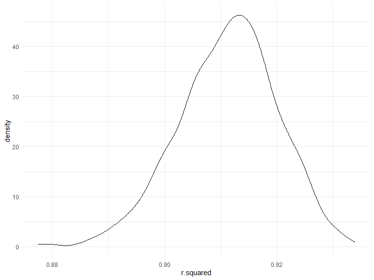
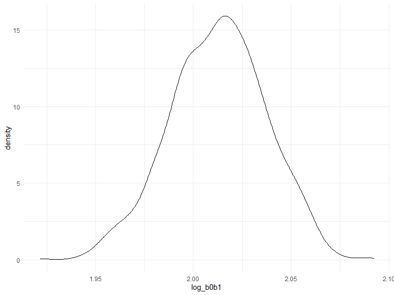
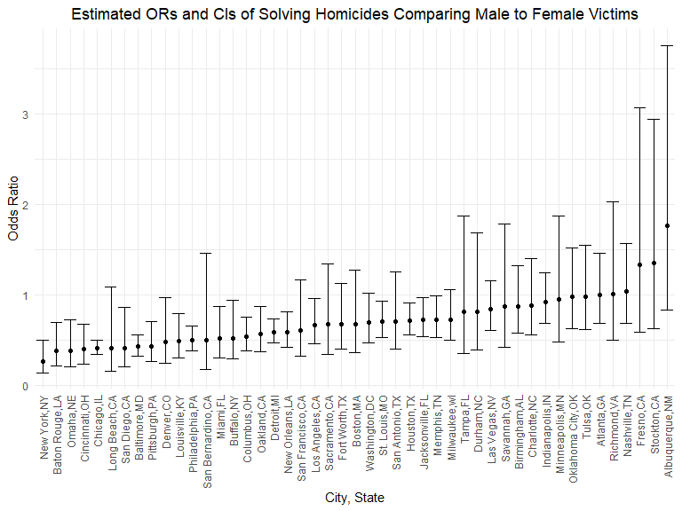
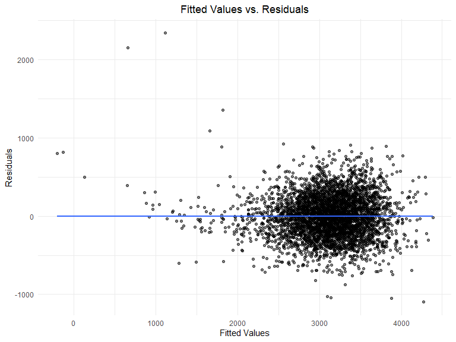
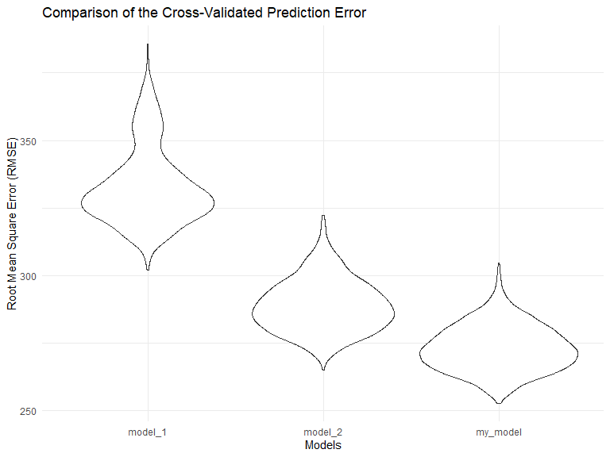

Homework 6
================
Suning Zhao
2022-12-03

``` r
library(tidyverse)
library(modelr)
library(mgcv)
library(purrr)
```

### Problem 1

To obtain a distribution for $\hat{r}^2$, we’ll follow basically the
same procedure we used for regression coefficients: draw bootstrap
samples; the a model to each; extract the value I’m concerned with; and
summarize. Here, we’ll use `modelr::bootstrap` to draw the samples and
`broom::glance` to produce `r.squared` values.

``` r
weather_df = 
  rnoaa::meteo_pull_monitors(
    c("USW00094728"),
    var = c("PRCP", "TMIN", "TMAX"), 
    date_min = "2017-01-01",
    date_max = "2017-12-31") %>%
  mutate(
    name = recode(id, USW00094728 = "CentralPark_NY"),
    tmin = tmin / 10,
    tmax = tmax / 10) %>%
  select(name, id, everything())
```

    ## Registered S3 method overwritten by 'hoardr':
    ##   method           from
    ##   print.cache_info httr

    ## using cached file: C:\Users\SUNING~1\AppData\Local/Cache/R/noaa_ghcnd/USW00094728.dly

    ## date created (size, mb): 2022-10-12 22:30:14 (8.428)

    ## file min/max dates: 1869-01-01 / 2022-10-31

``` r
weather_df %>% 
  modelr::bootstrap(n = 1000) %>% 
  mutate(
    models = map(strap, ~lm(tmax ~ tmin, data = .x) ),
    results = map(models, broom::glance)) %>% 
  select(-strap, -models) %>% 
  unnest(results) %>% 
  ggplot(aes(x = r.squared)) + geom_density()
```



In this example, the $\hat{r}^2$ value is high, and the upper bound at 1
may be a cause for the generally skewed shape of the distribution. If we
wanted to construct a confidence interval for $R^2$, we could take the
2.5% and 97.5% quantiles of the estimates across bootstrap samples.
However, because the shape isn’t symmetric, using the mean +/- 1.96
times the standard error probably wouldn’t work well.

We can produce a distribution for $\log(\beta_0 * \beta1)$ using a
similar approach, with a bit more wrangling before we make our plot.

``` r
weather_df %>% 
  modelr::bootstrap(n = 1000) %>% 
  mutate(
    models = map(strap, ~lm(tmax ~ tmin, data = .x) ),
    results = map(models, broom::tidy)) %>% 
  select(-strap, -models) %>% 
  unnest(results) %>% 
  select(id = `.id`, term, estimate) %>% 
  pivot_wider(
    names_from = term, 
    values_from = estimate) %>% 
  rename(beta0 = `(Intercept)`, beta1 = tmin) %>% 
  mutate(log_b0b1 = log(beta0 * beta1)) %>% 
  ggplot(aes(x = log_b0b1)) + geom_density()
```



As with $r^2$, this distribution is somewhat skewed and has some
outliers.

The point of this is not to say you should always use the bootstrap –
it’s possible to establish “large sample” distributions for strange
parameters / values / summaries in a lot of cases, and those are great
to have. But it is helpful to know that there’s a way to do inference
even in tough cases.

### Problem 2

``` r
homicides_raw_df = 
  read_csv("data/homicide-data.csv") %>% 
  janitor::clean_names() %>% 
  mutate(
    city_state = str_c(city,state, sep = ","),
    homicides_status = as.numeric(disposition == "Closed by arrest"),
    victim_age = as.numeric(victim_age),
    victim_race = fct_relevel(victim_race, "White")
  ) %>% 
  filter(
    !city_state %in% c("Dallas,TX", "Phoneix,AZ", "Kansas City,MO", "Tulsa,AL"),
    victim_race %in% c("White", "Black")
    )
```

    ## Rows: 52179 Columns: 12
    ## ── Column specification ────────────────────────────────────────────────────────
    ## Delimiter: ","
    ## chr (9): uid, victim_last, victim_first, victim_race, victim_age, victim_sex...
    ## dbl (3): reported_date, lat, lon
    ## 
    ## ℹ Use `spec()` to retrieve the full column specification for this data.
    ## ℹ Specify the column types or set `show_col_types = FALSE` to quiet this message.

``` r
glm_baltimore = 
  homicides_raw_df %>%
  filter(city_state == "Baltimore,MD") %>% 
  glm(homicides_status ~ victim_age + victim_sex + victim_race, data = ., family = binomial()) %>% 
  broom::tidy() %>% 
  mutate(OR = exp(estimate),
         CI_lower = exp(estimate - 1.96 * std.error),
         CI_upper = exp(estimate + 1.96 * std.error)) %>%
  select(term, OR, CI_lower, CI_upper) %>% 
  filter(term == "victim_sexMale")

glm_baltimore %>% 
knitr::kable(digits = 3)
```

| term           |    OR | CI_lower | CI_upper |
|:---------------|------:|---------:|---------:|
| victim_sexMale | 0.426 |    0.325 |    0.558 |

``` r
glm_homicides_df = 
  homicides_raw_df %>%
  nest(data = -city_state) %>% 
  mutate(
    models = map(data, ~glm(homicides_status ~ victim_age + victim_sex + victim_race, data = ., family = binomial())),
    results = map(models, broom::tidy)
    ) %>% 
  select(-data, -models) %>% 
  unnest(results) %>% 
  mutate(OR = exp(estimate),
         CI_lower = exp(estimate - 1.96 * std.error),
         CI_upper = exp(estimate + 1.96 * std.error)) %>%
  filter(term == "victim_sexMale") %>% 
  select(city_state, OR, CI_lower, CI_upper)


glm_homicides_df %>% 
  knitr::kable(digits = 3)
```

| city_state        |    OR | CI_lower | CI_upper |
|:------------------|------:|---------:|---------:|
| Albuquerque,NM    | 1.767 |    0.831 |    3.761 |
| Atlanta,GA        | 1.000 |    0.684 |    1.463 |
| Baltimore,MD      | 0.426 |    0.325 |    0.558 |
| Baton Rouge,LA    | 0.381 |    0.209 |    0.695 |
| Birmingham,AL     | 0.870 |    0.574 |    1.318 |
| Boston,MA         | 0.674 |    0.356 |    1.276 |
| Buffalo,NY        | 0.521 |    0.290 |    0.935 |
| Charlotte,NC      | 0.884 |    0.557 |    1.403 |
| Chicago,IL        | 0.410 |    0.336 |    0.501 |
| Cincinnati,OH     | 0.400 |    0.236 |    0.677 |
| Columbus,OH       | 0.532 |    0.378 |    0.750 |
| Denver,CO         | 0.479 |    0.236 |    0.971 |
| Detroit,MI        | 0.582 |    0.462 |    0.734 |
| Durham,NC         | 0.812 |    0.392 |    1.683 |
| Fort Worth,TX     | 0.669 |    0.397 |    1.127 |
| Fresno,CA         | 1.335 |    0.580 |    3.071 |
| Houston,TX        | 0.711 |    0.558 |    0.907 |
| Indianapolis,IN   | 0.919 |    0.679 |    1.242 |
| Jacksonville,FL   | 0.720 |    0.537 |    0.966 |
| Las Vegas,NV      | 0.837 |    0.608 |    1.154 |
| Long Beach,CA     | 0.410 |    0.156 |    1.082 |
| Los Angeles,CA    | 0.662 |    0.458 |    0.956 |
| Louisville,KY     | 0.491 |    0.305 |    0.790 |
| Memphis,TN        | 0.723 |    0.529 |    0.988 |
| Miami,FL          | 0.515 |    0.304 |    0.872 |
| Milwaukee,wI      | 0.727 |    0.499 |    1.060 |
| Minneapolis,MN    | 0.947 |    0.478 |    1.875 |
| Nashville,TN      | 1.034 |    0.685 |    1.562 |
| New Orleans,LA    | 0.585 |    0.422 |    0.811 |
| New York,NY       | 0.262 |    0.138 |    0.499 |
| Oakland,CA        | 0.563 |    0.365 |    0.868 |
| Oklahoma City,OK  | 0.974 |    0.624 |    1.520 |
| Omaha,NE          | 0.382 |    0.203 |    0.721 |
| Philadelphia,PA   | 0.496 |    0.378 |    0.652 |
| Pittsburgh,PA     | 0.431 |    0.265 |    0.700 |
| Richmond,VA       | 1.006 |    0.498 |    2.033 |
| San Antonio,TX    | 0.705 |    0.398 |    1.249 |
| Sacramento,CA     | 0.669 |    0.335 |    1.337 |
| Savannah,GA       | 0.867 |    0.422 |    1.780 |
| San Bernardino,CA | 0.500 |    0.171 |    1.462 |
| San Diego,CA      | 0.413 |    0.200 |    0.855 |
| San Francisco,CA  | 0.608 |    0.317 |    1.165 |
| St. Louis,MO      | 0.703 |    0.530 |    0.932 |
| Stockton,CA       | 1.352 |    0.621 |    2.942 |
| Tampa,FL          | 0.808 |    0.348 |    1.876 |
| Tulsa,OK          | 0.976 |    0.614 |    1.552 |
| Washington,DC     | 0.690 |    0.468 |    1.017 |

``` r
glm_homicides_df %>% 
  mutate(city_state = fct_reorder(city_state, OR)) %>%
  ggplot(aes(x = city_state, y = OR))+
  geom_point()+
  geom_errorbar(mapping = aes(ymin = CI_lower, ymax = CI_upper))+
  labs( x = "City, State",  y = "Odds Ratio", title = "Estimated ORs and CIs of Solving Homicides Comparing Male to Female Victims") + 
  theme(plot.title = element_text(hjust = 0.5)) + 
  theme(axis.text.x = element_text(angle = 90, vjust = 0.5, hjust = 1))
```



### Problem 3

``` r
birth_weight_df = 
  read_csv("data/birthweight.csv") %>% 
  mutate(
    babysex = as.factor(babysex),
    frace = as.factor(frace),
    malform = as.factor(malform),
    mrace = as.factor(mrace),
  )
```

    ## Rows: 4342 Columns: 20
    ## ── Column specification ────────────────────────────────────────────────────────
    ## Delimiter: ","
    ## dbl (20): babysex, bhead, blength, bwt, delwt, fincome, frace, gaweeks, malf...
    ## 
    ## ℹ Use `spec()` to retrieve the full column specification for this data.
    ## ℹ Specify the column types or set `show_col_types = FALSE` to quiet this message.

``` r
sum(is.na(birth_weight_df))
```

    ## [1] 0

``` r
my_model <- lm(bwt ~.,
               data =birth_weight_df)
step(my_model, direction = "both", trace  = FALSE)
```

    ## 
    ## Call:
    ## lm(formula = bwt ~ babysex + bhead + blength + delwt + fincome + 
    ##     gaweeks + mheight + mrace + parity + ppwt + smoken, data = birth_weight_df)
    ## 
    ## Coefficients:
    ## (Intercept)     babysex2        bhead      blength        delwt      fincome  
    ##   -6098.822       28.558      130.777       74.947        4.107        0.318  
    ##     gaweeks      mheight       mrace2       mrace3       mrace4       parity  
    ##      11.592        6.594     -138.792      -74.887     -100.678       96.305  
    ##        ppwt       smoken  
    ##      -2.676       -4.843

``` r
summary(my_model)
```

    ## 
    ## Call:
    ## lm(formula = bwt ~ ., data = birth_weight_df)
    ## 
    ## Residuals:
    ##      Min       1Q   Median       3Q      Max 
    ## -1097.68  -184.86    -3.33   173.09  2344.15 
    ## 
    ## Coefficients: (3 not defined because of singularities)
    ##               Estimate Std. Error t value Pr(>|t|)    
    ## (Intercept) -6265.3914   660.4011  -9.487  < 2e-16 ***
    ## babysex2       28.7073     8.4652   3.391 0.000702 ***
    ## bhead         130.7781     3.4523  37.881  < 2e-16 ***
    ## blength        74.9536     2.0217  37.075  < 2e-16 ***
    ## delwt           4.1007     0.3948  10.386  < 2e-16 ***
    ## fincome         0.2898     0.1795   1.614 0.106551    
    ## frace2         14.3313    46.1501   0.311 0.756168    
    ## frace3         21.2361    69.2960   0.306 0.759273    
    ## frace4        -46.9962    44.6782  -1.052 0.292912    
    ## frace8          4.2969    74.0741   0.058 0.953745    
    ## gaweeks        11.5494     1.4654   7.882 4.06e-15 ***
    ## malform1        9.7650    70.6259   0.138 0.890039    
    ## menarche       -3.5508     2.8951  -1.226 0.220083    
    ## mheight         9.7874    10.3116   0.949 0.342588    
    ## momage          0.7593     1.2221   0.621 0.534418    
    ## mrace2       -151.4354    46.0453  -3.289 0.001014 ** 
    ## mrace3        -91.3866    71.9190  -1.271 0.203908    
    ## mrace4        -56.4787    45.1369  -1.251 0.210901    
    ## parity         95.5411    40.4793   2.360 0.018307 *  
    ## pnumlbw             NA         NA      NA       NA    
    ## pnumsga             NA         NA      NA       NA    
    ## ppbmi           4.3538    14.8913   0.292 0.770017    
    ## ppwt           -3.4716     2.6121  -1.329 0.183913    
    ## smoken         -4.8544     0.5871  -8.269  < 2e-16 ***
    ## wtgain              NA         NA      NA       NA    
    ## ---
    ## Signif. codes:  0 '***' 0.001 '**' 0.01 '*' 0.05 '.' 0.1 ' ' 1
    ## 
    ## Residual standard error: 272.5 on 4320 degrees of freedom
    ## Multiple R-squared:  0.7183, Adjusted R-squared:  0.717 
    ## F-statistic: 524.6 on 21 and 4320 DF,  p-value: < 2.2e-16

``` r
birth_weight_df %>% 
  add_predictions(my_model) %>% 
  add_residuals(my_model) %>% 
  ggplot(aes(x = pred, y = resid)) +
  geom_point(alpha = 0.5) +
  geom_smooth(formula = 'y ~ x',method = "lm", se = FALSE) +
  labs(title = "Fitted Values vs. Residuals",
       x = "Fitted Values", 
       y = "Residuals") +
  theme(plot.title = element_text(hjust = 0.5))
```



``` r
model_1 = lm(bwt ~ blength + gaweeks, data = birth_weight_df)

model_2 = lm(bwt ~ bhead + blength + babysex + bhead*blength + bhead*babysex + blength*babysex + bhead*blength*babysex,
               data = birth_weight_df)

model_1 
```

    ## 
    ## Call:
    ## lm(formula = bwt ~ blength + gaweeks, data = birth_weight_df)
    ## 
    ## Coefficients:
    ## (Intercept)      blength      gaweeks  
    ##    -4347.67       128.56        27.05

``` r
model_2
```

    ## 
    ## Call:
    ## lm(formula = bwt ~ bhead + blength + babysex + bhead * blength + 
    ##     bhead * babysex + blength * babysex + bhead * blength * babysex, 
    ##     data = birth_weight_df)
    ## 
    ## Coefficients:
    ##            (Intercept)                   bhead                 blength  
    ##             -7176.8170                181.7956                102.1269  
    ##               babysex2           bhead:blength          bhead:babysex2  
    ##              6374.8684                 -0.5536               -198.3932  
    ##       blength:babysex2  bhead:blength:babysex2  
    ##              -123.7729                  3.8781

``` r
cv_df = 
  crossv_mc(birth_weight_df, 100) %>% 
  mutate(train = map(train, as_tibble),
    test = map(test, as_tibble))%>% 
  mutate(
    model_1  = map(train, ~lm(bwt ~ blength + gaweeks, data = .x)),
    model_2  = map(train, ~lm(bwt ~ bhead * blength * babysex, data = .x)),
    my_model  = map(train, ~lm(bwt ~ babysex + bhead + blength + delwt + fincome + gaweeks + mheight + mrace + parity + ppwt + smoken, data = .x ))) %>% 
  mutate(
    rmse_model_1 = map2_dbl(model_1, test, ~rmse(model = .x, data = .y)),
    rmse_model_2  = map2_dbl(model_2, test, ~rmse(model = .x, data = .y)),
    rmse_my_model = map2_dbl(my_model, test, ~rmse(model = .x, data = .y)))

cv_df %>% 
  select(starts_with("rmse")) %>%
  pivot_longer(
    everything(),
    names_to = "model",
    values_to = "rmse",
    names_prefix = "rmse_"
  ) %>%
  mutate(model = fct_inorder(model)) %>% 
  ggplot(aes(x = model, y = rmse)) + 
  geom_violin() +
  labs(title = "Comparison of the Cross-Validated Prediction Error", 
       x = "Models", 
       y = "Root Mean Square Error (RMSE)")   
```


