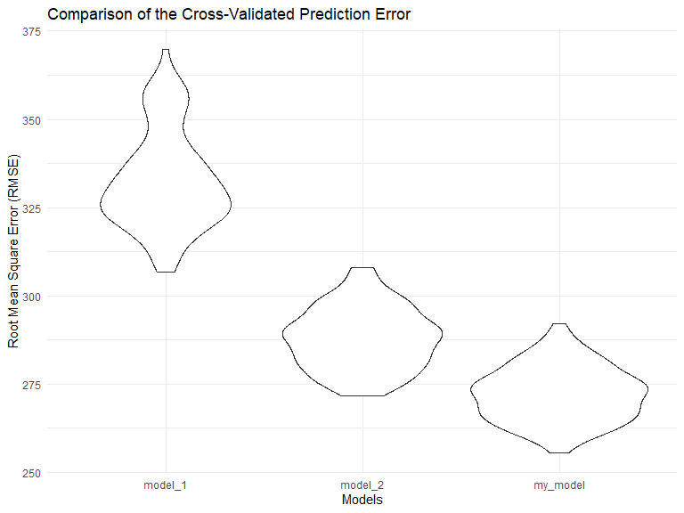

Homework 6
================
Suning Zhao
2022-12-03

``` r
library(tidyverse)
library(modelr)
library(mgcv)
library(purrr)
```

### Problem 1

To obtain a distribution for $\hat{r}^2$, we’ll follow basically the
same procedure we used for regression coefficients: draw bootstrap
samples; the a model to each; extract the value I’m concerned with; and
summarize. Here, we’ll use `modelr::bootstrap` to draw the samples and
`broom::glance` to produce `r.squared` values.

``` r
weather_df = 
  rnoaa::meteo_pull_monitors(
    c("USW00094728"),
    var = c("PRCP", "TMIN", "TMAX"), 
    date_min = "2017-01-01",
    date_max = "2017-12-31") %>%
  mutate(
    name = recode(id, USW00094728 = "CentralPark_NY"),
    tmin = tmin / 10,
    tmax = tmax / 10) %>%
  select(name, id, everything())
```

    ## Registered S3 method overwritten by 'hoardr':
    ##   method           from
    ##   print.cache_info httr

    ## using cached file: C:\Users\SUNING~1\AppData\Local/Cache/R/noaa_ghcnd/USW00094728.dly

    ## date created (size, mb): 2022-10-12 22:30:14 (8.428)

    ## file min/max dates: 1869-01-01 / 2022-10-31

``` r
weather_df %>% 
  modelr::bootstrap(n = 1000) %>% 
  mutate(
    models = map(strap, ~lm(tmax ~ tmin, data = .x) ),
    results = map(models, broom::glance)) %>% 
  select(-strap, -models) %>% 
  unnest(results) %>% 
  ggplot(aes(x = r.squared)) + geom_density()
```


In this example, the $\hat{r}^2$ value is high, and the upper bound at 1
may be a cause for the generally skewed shape of the distribution. If we
wanted to construct a confidence interval for $R^2$, we could take the
2.5% and 97.5% quantiles of the estimates across bootstrap samples.
However, because the shape isn’t symmetric, using the mean +/- 1.96
times the standard error probably wouldn’t work well.

We can produce a distribution for $\log(\beta_0 * \beta1)$ using a
similar approach, with a bit more wrangling before we make our plot.

``` r
weather_df %>% 
  modelr::bootstrap(n = 1000) %>% 
  mutate(
    models = map(strap, ~lm(tmax ~ tmin, data = .x) ),
    results = map(models, broom::tidy)) %>% 
  select(-strap, -models) %>% 
  unnest(results) %>% 
  select(id = `.id`, term, estimate) %>% 
  pivot_wider(
    names_from = term, 
    values_from = estimate) %>% 
  rename(beta0 = `(Intercept)`, beta1 = tmin) %>% 
  mutate(log_b0b1 = log(beta0 * beta1)) %>% 
  ggplot(aes(x = log_b0b1)) + geom_density()
```


As with $r^2$, this distribution is somewhat skewed and has some
outliers.

The point of this is not to say you should always use the bootstrap –
it’s possible to establish “large sample” distributions for strange
parameters / values / summaries in a lot of cases, and those are great
to have. But it is helpful to know that there’s a way to do inference
even in tough cases.

### Problem 2

#### Loading the dataset

-   First, I used `read_csv` to read the original dataset and used
    `janitor::clean_names` to clean the title.
-   Then, I used `mutate` to create `city_state` variable and a binary
    variable indicating whether the homicide is solved called
    `homicides_status`, and translate `victim_age` as a numeric vector.
-   Lastly, I used `filter` to omit some cities and limit the analysis
    for whom `victim_race` is `white` or `black`.

``` r
homicides_raw_df = 
  read_csv("data/homicide-data.csv") %>% 
  janitor::clean_names() %>% 
  mutate(
    city_state = str_c(city,state, sep = ","),
    homicides_status = as.numeric(disposition == "Closed by arrest"),
    victim_age = as.numeric(victim_age)
  ) %>% 
  filter(
    !city_state %in% c("Dallas,TX", "Phoneix,AZ", "Kansas City,MO", "Tulsa,AL"),
    victim_race %in% c("White", "Black")
    )
```

    ## Rows: 52179 Columns: 12
    ## ── Column specification ────────────────────────────────────────────────────────
    ## Delimiter: ","
    ## chr (9): uid, victim_last, victim_first, victim_race, victim_age, victim_sex...
    ## dbl (3): reported_date, lat, lon
    ## 
    ## ℹ Use `spec()` to retrieve the full column specification for this data.
    ## ℹ Specify the column types or set `show_col_types = FALSE` to quiet this message.

#### Create a GLM model for Baltimore,MD

-   First, I used `glm` function to fit a logistic regression model with
    `homicides_status` as outcome and `victim_age`, `victim_sex` and
    `victim_race` as predictors.
-   Then, I applied `broom::tidy` to this object.
-   In order to estimate the odds ratio and confidence interval, I used
    `exp` to translate the log odds ratio to odds ratio, and calculate
    the 95% confidence interval by multiple 1.96.
-   Finally, I used `filter` to only compare male victims to female
    victims keeping all other variables fixed.

``` r
glm_baltimore = 
  homicides_raw_df %>%
  filter(city_state == "Baltimore,MD") %>% 
  glm(homicides_status ~ victim_age + victim_sex + victim_race, data = ., family = binomial()) %>% 
  broom::tidy() %>% 
  mutate(OR = exp(estimate),
         CI_lower = exp(estimate - 1.96 * std.error),
         CI_upper = exp(estimate + 1.96 * std.error)) %>%
  select(term, OR, CI_lower, CI_upper) %>% 
  filter(term == "victim_sexMale")

glm_baltimore %>% 
knitr::kable(digits = 3)
```

| term           |    OR | CI_lower | CI_upper |
|:---------------|------:|---------:|---------:|
| victim_sexMale | 0.426 |    0.325 |    0.558 |

#### Create a GLM model for each cities

-   In order to create a GLM model for each cities, firstly, I used
    `nest` to nest the datas excluding `city_state`.
-   Then, I used `mutate` and `map` to generalize logistic regression
    model for each city and marked the results as `results`.
-   After that, I `unnest` the dataframe and used `mutate` to translate
    log odds ratio and calculate the confidence interval.
-   Finally, I used `filter` to only compare male victims to female
    victims keeping all other variables fixed.

``` r
glm_homicides_df = 
  homicides_raw_df %>%
  nest(data = -city_state) %>% 
  mutate(
    models = map(data, ~glm(homicides_status ~ victim_age + victim_sex + victim_race, data = ., family = binomial())),
    results = map(models, broom::tidy)
    ) %>% 
  select(-data, -models) %>% 
  unnest(results) %>% 
  mutate(OR = exp(estimate),
         CI_lower = exp(estimate - 1.96 * std.error),
         CI_upper = exp(estimate + 1.96 * std.error)) %>%
  filter(term == "victim_sexMale") %>% 
  select(city_state, OR, CI_lower, CI_upper)

glm_homicides_df %>% 
  knitr::kable(digits = 3)
```

| city_state        |    OR | CI_lower | CI_upper |
|:------------------|------:|---------:|---------:|
| Albuquerque,NM    | 1.767 |    0.831 |    3.761 |
| Atlanta,GA        | 1.000 |    0.684 |    1.463 |
| Baltimore,MD      | 0.426 |    0.325 |    0.558 |
| Baton Rouge,LA    | 0.381 |    0.209 |    0.695 |
| Birmingham,AL     | 0.870 |    0.574 |    1.318 |
| Boston,MA         | 0.674 |    0.356 |    1.276 |
| Buffalo,NY        | 0.521 |    0.290 |    0.935 |
| Charlotte,NC      | 0.884 |    0.557 |    1.403 |
| Chicago,IL        | 0.410 |    0.336 |    0.501 |
| Cincinnati,OH     | 0.400 |    0.236 |    0.677 |
| Columbus,OH       | 0.532 |    0.378 |    0.750 |
| Denver,CO         | 0.479 |    0.236 |    0.971 |
| Detroit,MI        | 0.582 |    0.462 |    0.734 |
| Durham,NC         | 0.812 |    0.392 |    1.683 |
| Fort Worth,TX     | 0.669 |    0.397 |    1.127 |
| Fresno,CA         | 1.335 |    0.580 |    3.071 |
| Houston,TX        | 0.711 |    0.558 |    0.907 |
| Indianapolis,IN   | 0.919 |    0.679 |    1.242 |
| Jacksonville,FL   | 0.720 |    0.537 |    0.966 |
| Las Vegas,NV      | 0.837 |    0.608 |    1.154 |
| Long Beach,CA     | 0.410 |    0.156 |    1.082 |
| Los Angeles,CA    | 0.662 |    0.458 |    0.956 |
| Louisville,KY     | 0.491 |    0.305 |    0.790 |
| Memphis,TN        | 0.723 |    0.529 |    0.988 |
| Miami,FL          | 0.515 |    0.304 |    0.872 |
| Milwaukee,wI      | 0.727 |    0.499 |    1.060 |
| Minneapolis,MN    | 0.947 |    0.478 |    1.875 |
| Nashville,TN      | 1.034 |    0.685 |    1.562 |
| New Orleans,LA    | 0.585 |    0.422 |    0.811 |
| New York,NY       | 0.262 |    0.138 |    0.499 |
| Oakland,CA        | 0.563 |    0.365 |    0.868 |
| Oklahoma City,OK  | 0.974 |    0.624 |    1.520 |
| Omaha,NE          | 0.382 |    0.203 |    0.721 |
| Philadelphia,PA   | 0.496 |    0.378 |    0.652 |
| Pittsburgh,PA     | 0.431 |    0.265 |    0.700 |
| Richmond,VA       | 1.006 |    0.498 |    2.033 |
| San Antonio,TX    | 0.705 |    0.398 |    1.249 |
| Sacramento,CA     | 0.669 |    0.335 |    1.337 |
| Savannah,GA       | 0.867 |    0.422 |    1.780 |
| San Bernardino,CA | 0.500 |    0.171 |    1.462 |
| San Diego,CA      | 0.413 |    0.200 |    0.855 |
| San Francisco,CA  | 0.608 |    0.317 |    1.165 |
| St. Louis,MO      | 0.703 |    0.530 |    0.932 |
| Stockton,CA       | 1.352 |    0.621 |    2.942 |
| Tampa,FL          | 0.808 |    0.348 |    1.876 |
| Tulsa,OK          | 0.976 |    0.614 |    1.552 |
| Washington,DC     | 0.690 |    0.468 |    1.017 |

#### Create a plot that shows the estimated ORs and CIs for each city

-   First, I reordered the cities according to OR using `fct_reorder`.
-   Then, I created a plot use `ggplot`, `geom_point` and `geom_line`.

``` r
glm_homicides_df %>% 
  mutate(city_state = fct_reorder(city_state, OR)) %>%
  ggplot(aes(x = city_state, y = OR))+
  geom_point()+
  geom_errorbar(mapping = aes(ymin = CI_lower, ymax = CI_upper))+
  labs( x = "City, State",  y = "Odds Ratio", title = "Estimated ORs and CIs of Solving Homicides Comparing Male to Female Victims") + 
  theme(plot.title = element_text(hjust = 0.5)) + 
  theme(axis.text.x = element_text(angle = 90, vjust = 0.5, hjust = 1))
```


-   According to the plot, we can know that the estimated odds ratio of
    solving homicides between male and female victims lies in between 0
    and 2.
-   For 50 cities, only 4 cities are with odds ratio higher than 1,
    which suggests that male victims has a larger chance to have a
    solving homicides. Those cities are Nashville,TN, Fresno,CA,
    Stockton,CA, and Albuquerque,NM.
-   `Fresno,CA`, `Stockton,CA`, and `Albuquerque,NM`have wider
    confidence intervals than others, with higher standard errors. Those
    may be because of a small sample in those cities or some outliers.

### Problem 3

#### Load and clean the data for regression analysis

-   I used `read_csv` to read the original file in dataset, and then
    used `mutate` to translate parts of numeric variables into factors.
-   Then I tested the missing data using `sum`. It showed that there was
    no missing value in the dataset.

``` r
birth_weight_df = 
  read_csv("data/birthweight.csv") %>% 
  mutate(
    babysex = as.factor(babysex),
    frace = as.factor(frace),
    malform = as.factor(malform),
    mrace = as.factor(mrace),
  )
```

    ## Rows: 4342 Columns: 20
    ## ── Column specification ────────────────────────────────────────────────────────
    ## Delimiter: ","
    ## dbl (20): babysex, bhead, blength, bwt, delwt, fincome, frace, gaweeks, malf...
    ## 
    ## ℹ Use `spec()` to retrieve the full column specification for this data.
    ## ℹ Specify the column types or set `show_col_types = FALSE` to quiet this message.

``` r
sum(is.na(birth_weight_df))
```

    ## [1] 0

#### Create a regression model for birthweight

-   I used `step` function to create the model using stepwise method.

``` r
my_model <- lm(bwt ~.,
               data =birth_weight_df)
step(my_model, direction = "both", trace  = FALSE)
```

    ## 
    ## Call:
    ## lm(formula = bwt ~ babysex + bhead + blength + delwt + fincome + 
    ##     gaweeks + mheight + mrace + parity + ppwt + smoken, data = birth_weight_df)
    ## 
    ## Coefficients:
    ## (Intercept)     babysex2        bhead      blength        delwt      fincome  
    ##   -6098.822       28.558      130.777       74.947        4.107        0.318  
    ##     gaweeks      mheight       mrace2       mrace3       mrace4       parity  
    ##      11.592        6.594     -138.792      -74.887     -100.678       96.305  
    ##        ppwt       smoken  
    ##      -2.676       -4.843

``` r
my_model %>% 
  broom::tidy() %>% 
  select(term, estimate, p.value) %>% 
  knitr::kable(
    digits = 3,
    col.names = c("Term", "Estimate", "P-value")
  )
```

| Term        |  Estimate | P-value |
|:------------|----------:|--------:|
| (Intercept) | -6265.391 |   0.000 |
| babysex2    |    28.707 |   0.001 |
| bhead       |   130.778 |   0.000 |
| blength     |    74.954 |   0.000 |
| delwt       |     4.101 |   0.000 |
| fincome     |     0.290 |   0.107 |
| frace2      |    14.331 |   0.756 |
| frace3      |    21.236 |   0.759 |
| frace4      |   -46.996 |   0.293 |
| frace8      |     4.297 |   0.954 |
| gaweeks     |    11.549 |   0.000 |
| malform1    |     9.765 |   0.890 |
| menarche    |    -3.551 |   0.220 |
| mheight     |     9.787 |   0.343 |
| momage      |     0.759 |   0.534 |
| mrace2      |  -151.435 |   0.001 |
| mrace3      |   -91.387 |   0.204 |
| mrace4      |   -56.479 |   0.211 |
| parity      |    95.541 |   0.018 |
| pnumlbw     |        NA |      NA |
| pnumsga     |        NA |      NA |
| ppbmi       |     4.354 |   0.770 |
| ppwt        |    -3.472 |   0.184 |
| smoken      |    -4.854 |   0.000 |
| wtgain      |        NA |      NA |

-   The result shows that `babysex2`, `bhead`, `blength`, `delwt`,
    `fincome`, `gaweeks`, `mheight`, `mrace`, `parity`,`ppwt` and
    `smoken` can be the predictors.
-   Then, I created a plot to illustrate the relationship between
    residuals and fitted values, using `add_predictions` and
    `add_residuals`.

``` r
birth_weight_df %>% 
  add_predictions(my_model) %>% 
  add_residuals(my_model) %>% 
  ggplot(aes(x = pred, y = resid)) +
  geom_point(alpha = 0.5) +
  geom_smooth(formula = 'y ~ x',method = "lm", se = FALSE) +
  labs(title = "Fitted Values vs. Residuals",
       x = "Fitted Values", 
       y = "Residuals") +
  theme(plot.title = element_text(hjust = 0.5))
```


-   From the graph we can know that most of residuals are lying around 0
    when fitted value is between 2000 to 4000.
-   Some outliers should also be pointed out when fitted values are too
    small. The largest bias is around 2000. This might be due to the
    data collection step.

#### Compare my model to two others

-   Created the models first.

``` r
model_1 = lm(bwt ~ blength + gaweeks, data = birth_weight_df)

model_2 = lm(bwt ~ bhead + blength + babysex + bhead*blength + bhead*babysex + blength*babysex + bhead*blength*babysex,
               data = birth_weight_df)

model_1 %>% 
  broom::tidy() %>% 
  select(term, estimate, p.value) %>% 
  knitr::kable(
    digits = 3,
    col.names = c("Term", "Estimate", "P-value")
  )
```

| Term        |  Estimate | P-value |
|:------------|----------:|--------:|
| (Intercept) | -4347.667 |       0 |
| blength     |   128.556 |       0 |
| gaweeks     |    27.047 |       0 |

``` r
model_2 %>% 
  broom::tidy() %>% 
  select(term, estimate, p.value) %>% 
  knitr::kable(
    digits = 3,
    col.names = c("Term", "Estimate", "P-value")
  )
```

| Term                   |  Estimate | P-value |
|:-----------------------|----------:|--------:|
| (Intercept)            | -7176.817 |   0.000 |
| bhead                  |   181.796 |   0.000 |
| blength                |   102.127 |   0.000 |
| babysex2               |  6374.868 |   0.000 |
| bhead:blength          |    -0.554 |   0.478 |
| bhead:babysex2         |  -198.393 |   0.000 |
| blength:babysex2       |  -123.773 |   0.000 |
| bhead:blength:babysex2 |     3.878 |   0.000 |

-   From the results we can know that model 1 is with only two
    predictors, while model 2 is with 7 predictors, including some
    interactions. Because model 2 is much more complicated, it might be
    with a better prediction but we should check with the prediction
    error.

#### Check the prediction error between three models

-   First, I used `crossv_mc` and `map` to generate train dataset and
    test dataset.
-   Then I generated models in each dataset and calculated the rmse.
-   Last, I created a plot for RMSE among three models.

``` r
cv_df = 
  crossv_mc(birth_weight_df, 100) %>% 
  mutate(train = map(train, as_tibble),
    test = map(test, as_tibble))%>% 
  mutate(
    model_1  = map(train, ~lm(bwt ~ blength + gaweeks, data = .x)),
    model_2  = map(train, ~lm(bwt ~ bhead * blength * babysex, data = .x)),
    my_model  = map(train, ~lm(bwt ~ babysex + bhead + blength + delwt + fincome + gaweeks + mheight + mrace + parity + ppwt + smoken, data = .x ))) %>% 
  mutate(
    rmse_model_1 = map2_dbl(model_1, test, ~rmse(model = .x, data = .y)),
    rmse_model_2  = map2_dbl(model_2, test, ~rmse(model = .x, data = .y)),
    rmse_my_model = map2_dbl(my_model, test, ~rmse(model = .x, data = .y)))

cv_df %>% 
  select(starts_with("rmse")) %>%
  pivot_longer(
    everything(),
    names_to = "model",
    values_to = "rmse",
    names_prefix = "rmse_"
  ) %>%
  mutate(model = fct_inorder(model)) %>% 
  ggplot(aes(x = model, y = rmse)) + 
  geom_violin() +
  labs(title = "Comparison of the Cross-Validated Prediction Error", 
       x = "Models", 
       y = "Root Mean Square Error (RMSE)")   
```



-   From the graph we can know that my model is with the smallest RMSE,
    which means that it can predict the birthweight best.
-   For two models, model 2 is better than model 1, with a smaller RMSE.
    The RMSE for my model is not with a huge difference compared with
    model 2.
